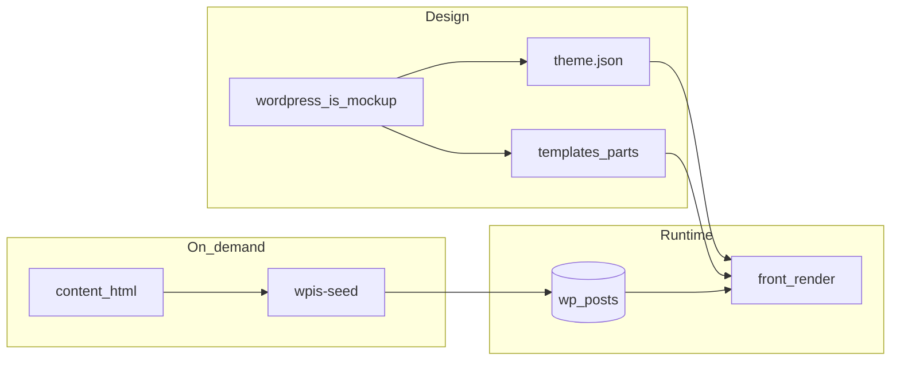

# Audit WPIS — thème bloc FSE vs Twenty Twenty * vs maquette

**Périmètre:** [wpis-theme/](../) (dépôt) — **ce fichier** : `docs/wpis-fse-theme-audit.md`  
**Sources de vérité (dépôt monorepo / clone à côté du thème) :** [wordpress-is-mockup.html](../../wordpress-is-mockup.html) (11 écrans), [wordpress-is-vision.md](../../wordpress-is-vision.md), [wordpress-is-cursor-plan.md](../../wordpress-is-cursor-plan.md)  
**Référence « canon » thème bloc :** [WordPress/twentytwentyfive](https://github.com/WordPress/twentytwentyfive) — `theme.json`, `styles/`, `templates/`, `parts/`, `patterns/` (pas d’écriture base au chargement thème)

---

## 1. Résumé exécutif

- Le thème repose sur une **séparation claire** : jetons et variations dans `theme.json`, chrome et mode sombre dans [assets/css/wpis-global.css](../assets/css/wpis-global.css), corps d’écran dans [content/html/*.html](../content/html/) avec patterns enregistrés par [inc/register-patterns.php](../inc/register-patterns.php) et import démo **optionnel** via `wp wpis-seed` ([inc/wpis-cli-seed.php](../inc/wpis-cli-seed.php)) ou [tools/seed-demo.php](../tools/seed-demo.php). **Aucun** hook `after_switch_theme` n’apparaît dans le thème, en phase avec l’esprit Twenty Twenty.
- **Dette documentaire** : [docs/wpis-fse-architecture.md](../../docs/wpis-fse-architecture.md) (mono-repo) et, si le dossier [`.cursor`](../../.cursor) est présent au même niveau que le thème, [wpis-fse-theme.mdc](../../.cursor/rules/wpis-fse-theme.mdc) : ils décrivent encore un bootstrap à l’activation et un fichier `wpis-chrome.css` inexistant. Le [README.md](../README.md) (L23–24) est **à jour** sur l’import explicite. Aligner l’architecture et la règle Cursor sur le code est une **action recommandée**.
- **Gaps produit** : pas de [archive.html](../templates) pour le CPT `quote` / taxos ([templates/index.html](../templates/index.html) cible le post type `post` par défaut). Le plugin gouvernera single / archives.

---

## 2. Inventaire (chemins clés, rôle, FSE, maquette)

Légende : **FSE** = `theme.json`, blocs, HTML de templates. **Démo** = contenu d’exemple / styles proches de la [maquette](../../wordpress-is-mockup.html).

| Zone | Chemins | Rôle | FSE / démo | Note |
|------|---------|------|------------|------|
| Métadonnées | [style.css](../style.css), [readme.txt](../readme.txt), [README.md](../README.md) | en-têtes, doc install | Meta | `README` = vérité import |
| Thème FSE | [theme.json](../theme.json) | jetons, `styles` globaux, variations `core/group` + `core/paragraph` | FSE | cœur visuel + complément [wpis-global.css](../assets/css/wpis-global.css) |
| Qualité | [phpcs.xml.dist](../phpcs.xml.dist), [composer.json](../composer.json) | WPCS, CI | Outil | `vendor/bin/phpcs` : 0 erreur (exécution locale) |
| Bootstrap | [functions.php](../functions.php) | `wpis_theme_get_content_html`, skip link, `the_content` → alias, supports, enreg. styles / variations, assets, [register-patterns.php](../inc/register-patterns.php) | FSE + `the_content` | filtre couleur = dette (§7) |
| Setup / seed | [inc/theme-setup.php](../inc/theme-setup.php), [inc/wpis-cli-seed.php](../inc/wpis-cli-seed.php), [tools/seed-demo.php](../tools/seed-demo.php) | manifest pages, menu **WPIS Primary**, lecture statique, WP-CLI `wp wpis-seed` | Démo (DB) | **Pas** d’accroche activation |
| Patterns | [inc/register-patterns.php](../inc/register-patterns.php) | enreg. patterns écran → `content/html/*.html` | FSE | remplace d’anciens `*-body.php` monolithiques |
| Fragments inserter | [patterns/hero-stats-row.php](../patterns/hero-stats-row.php), [patterns/quote-card-negative.php](../patterns/quote-card-negative.php) | blocs d’exemple | FSE + démo | — |
| CSS | [assets/css/wpis-global.css](../assets/css/wpis-global.css) | `--*` sémantiques, `data-theme`, header/footer, feed, explore, cartes, **legacy** `.nav-bar` / `.screen` (~L87–L97) | maquette + FSE | réduire quand le JSON couvre assez |
| JS | [assets/js/theme-toggle.js](../assets/js/theme-toggle.js), [assets/js/feed-demo.js](../assets/js/feed-demo.js) | thème clair/sombre ; démo feed | toggle = garder ; feed = **démo** | [functions.php L229–L237](../functions.php) : `feed-demo` seulement front + page `security` |
| Polices | [assets/fonts/](../assets/fonts/), [assets/fonts/README.txt](../assets/fonts/README.txt) | WOFF2 locaux | FSE (`fontFace` dans [theme.json](../theme.json)) | — |
| Parts | [parts/header.html](../parts/header.html), [footer.html](../parts/footer.html), [quote-feed-card.html](../parts/quote-feed-card.html) | en-tête (nav `primary`), pied, fragment carte | FSE | — |
| Templates | [templates/](../templates/) (6 fichiers : `front-page`, `index`, `page`, `single`, `search`, `404`) | coquille | FSE | pas d’`archive.html` |
| Contenu | [content/html/*.html](../content/html/) (13 fichiers) | **source unique** patterns + `wpis-seed` | démo | `empty.html` : pattern seulement, **hors** manifest import ([theme-setup L46+](../inc/theme-setup.php)) |
| Outils / CI | [tools/verify-markup.php](../tools/verify-markup.php), [.github/workflows/ci.yml](../.github/workflows/ci.yml) | HTML custom, `register-patterns.php` ; `php -l` + PHPCS + strict | CI | voir §9 |

**Règles Cursor** (mono-repo) : [no-oxford-comma-english.mdc](../../.cursor/rules/no-oxford-comma-english.mdc), [no-unauthorized-version-bumps.mdc](../../.cursor/rules/no-unauthorized-version-bumps.mdc) — OK ; [wpis-fse-theme.mdc](../../.cursor/rules/wpis-fse-theme.mdc) : **désuét** (activation) — mettre à jour.

---

## 3. Cohérence activation, seed, CLI

| Source | Comportement annoncé | Statut |
|--------|----------------------|--------|
| [functions.php](../functions.php) | pas de `after_switch_theme` | **Aligné TT*** |
| [inc/theme-setup.php L1–3](../inc/theme-setup.php) | seed « WP-CLI / seed-demo.php only » | **Cohérent** |
| [README L23–24](../README.md) | `wp wpis-seed` + `php tools/seed-demo.php` | **Cohérent** |
| [docs/wpis-fse-architecture.md § Theme activation](../../docs/wpis-fse-architecture.md) | `after_switch_theme` | **Obsolète** |
| Même doc L10 : `wpis-chrome.css` | — | **Fichier inexistant** ; thème = `assets/css/wpis-global.css` |

[wp wpis-seed import](../inc/wpis-cli-seed.php) : `sync_content` **vrai** par défaut (écrasement des pages démo). Le [README](../README.md) l’indique. L’ancienne promesse contractuelle « jamais d’écrasement » dans [wpis-fse-architecture.md](../../docs/wpis-fse-architecture.md) est **en conflit** avec l’import actuel — à réécrire.

---

## 4. Tableau : écran maquette → WordPress

Barre d’outils [wordpress-is-mockup.html L495–L506](../../wordpress-is-mockup.html) : `home`, `detail`, `explore`, `taxonomy`, `search`, `about`, `how`, `submit`, `confirm`, `empty`, `profile`.

| Mockup | Mécanisme WP | Pattern [register-patterns.php](../inc/register-patterns.php) / seed | Après `wpis-seed import` | Écarts |
|--------|----------------|--------------------------------------|-----------------------------|--------|
| home | [front-page.html](../templates/front-page.html) + page `home` | `home-body` → `home.html` | contenu en **DB** | Query Loop + CPT ; `feed-demo.js` |
| detail | pages `quote` / `sample` (parent/enfant) ou futur `single` CPT | `detail-body` → `sample.html` | **DB** | modèle `single-quote` côté plugin |
| explore | page `explore` | `explore-body` | **DB** | liens d’archives taxo |
| taxonomy | pages `taxonomy`, `security` | `taxonomy-body` pointe **security.html** (pas `taxonomy.html`) | **DB** | nom « taxonomy » vs fichier enfant ; pas de template d’**archive** taxo |
| search | [search.html](../templates/search.html) vs page `search-demo` | `search-body` → `search-demo.html` | page démo en **DB** | recherche WP **≠** page maquette seule |
| about | page `about` | `about-body` | **DB** | — |
| how | page `how-it-works` | `how-body` | **DB** | — |
| submit | page `submit` | `submit-body` | **DB** | forme → plugin REST |
| confirm | page `submitted` | `confirm-body` | **DB** | — |
| empty / 404 | [404.html](../templates/404.html) + `empty.html` en pattern seulement | `empty-body` | **fichier** (pattern) ; pas d’import page | normal |
| profile | page `profile` | `profile-body` | **DB** | données profil = plugin |

---

## 5. Comparaison Twenty Twenty-Four / Five

[twentytwentyfive](https://github.com/WordPress/twentytwentyfive) structure `theme.json`, `templates/`, `parts/`, `patterns/`, **sans** création de contenus au chargement. **wpis-theme** suit ce principe côté **code** (seed via outil). Deux **écarts** de « pureté » : le filtre [the_content](../functions.php) sur variables CSS, et l’enregistrement de styles côté PHP en parallèle de [theme.json](../theme.json) (habituel). Le chargement ciblé de [feed-demo.js](../assets/js/feed-demo.js) est du comportement thème de **démo**, à retirer quand le flux est dynamique.

---

## 6. `theme.json` vs `wpis-global.css` vs JS

- **theme.json** : [layout 720 / 1320px](../theme.json) ; paires de couleurs jour/nuit ; variations `wpis-*` (groupes) ; alignement global des hex avec la [maquette L9–L24](../../wordpress-is-mockup.html).
- **wpis-global.css** : L23+ aliases **obligatoires** pour le couple `data-theme` + [theme-toggle.js](../assets/js/theme-toggle.js) ; skip-link ; header/footer ; explore (`.tax-card`, etc.) et feed (`.quote-card`) — **héritage maquette** dans `core/html` ; `.nav-bar` / `.screen` = **héritage outil** maquette, supprimables si plus référencés.
- **Filtre** `wpis_theme_semantic_colors_in_content` [functions L50–66](../functions.php) : raccourci pour sombre ; alternative long terme : ne sauver que sémantique ou imposer les alias en éditeur.
- **theme-toggle** : L26+ `data-theme` / stockage / icône ; [parts/header L13–L14](../parts/header.html) `aria-label` sur le lien.
- **feed-demo** : à supprimer quand le flux est géré par [Query Loop + plugin](../../docs/wpis-feed-query-loop.md).

---

## 7. Listes priorisées

### À supprimer ou conditionner (démo)

- Règles **`.nav-bar` / `.screen`** inutilisées dans le contenu public.
- **feed-demo.js** (ou constante thème) après adoption Query Loop.
- Paragraphes **obsolètes** (activation) dans [wpis-fse-architecture.md](../../docs/wpis-fse-architecture.md) et [wpis-fse-theme.mdc](../../.cursor/rules/wpis-fse-theme.mdc) ; mention **wpis-chrome.css**.

### À recoder (blocs / templates / architecture)

- Gros `core/html` : migrer vers blocs, boucle, plugin.
- Filtre **the_content** (couleurs) : stratégie sans réécriture.
- [templates/index.html](../templates/index.html) : `postType` « post » vs stratégie blog / citations.

### À garder provisoirement

- **wpis-global.css** dense tant que le HTML démo reste riche en classes.
- `register_block_style` + `theme.json` (double déclaration) pour l’inserter.
- Emplacement `primary` + [parts/header.html](../parts/header.html) (menu classique, rempli par `wpis-seed` si import).
- **Skip link** [functions L30+](../functions.php) (évite l’invalideur éditeur).
- Arbre de pages `quote/sample`, `taxonomy/security` (URLs de démo).

---

## 8. Architecture cible

- **Aucun** write DB sur **switch** de thème.
- **Outils** : `wp wpis-seed` / [tools/seed-demo.php](../tools/seed-demo.php).
- **Vérité** : [theme.json](../theme.json) + [templates/](../templates/) + [parts/](../parts/) ; éditorial en **DB** après import voulu.
- **Plugin** : CPT, taxos, soumission, profil — [wordpress-is-vision.md](../../wordpress-is-vision.md), [docs/wpis-plugin-boundary-submit.md](../../docs/wpis-plugin-boundary-submit.md).

---

## 9. Qualité, CI, limites

| Outil | Couvert | Manque |
|--------|---------|--------|
| [verify-markup.php L131+](../tools/verify-markup.php) | templates, parts, `content/html`, [patterns/](../patterns/), [register-patterns.php](../inc/register-patterns.php) | `theme.json` ; tests rendu patterns |
| CI [.github/workflows/ci.yml](../.github/workflows/ci.yml) | `php -l`, PHPCS, `WPIS_VERIFY_MARKUP_STRICT=1` | — |
| `parse_blocks` | optionnelle si `WP_LOAD_PATH` | profondeur limitée (warning L163) |

**PHPCS** : 0 signalement (run local 2026).

---

## 10. Index des références (fichiers `wpis-theme/`)

| Sujet | Fichier |
|-------|---------|
| Manifest | `inc/theme-setup.php` ~`wpis_theme_setup_get_manifest` L46+ |
| Patterns écran | `inc/register-patterns.php` |
| Filtre contenu | `functions.php` `wpis_theme_semantic_colors_in_content` |
| Navigation | `parts/header.html` |
| Assets | `functions.php` `wpis_theme_enqueue_assets` L204+ |
| CLI | `inc/wpis-cli-seed.php` |
| JS démo | `assets/js/feed-demo.js` ; condition `functions.php` L229–L237 |
| Sémantique couleur | `assets/css/wpis-global.css` L1–L77 |

*Aucun bump de `Version` dans `style.css`.*
