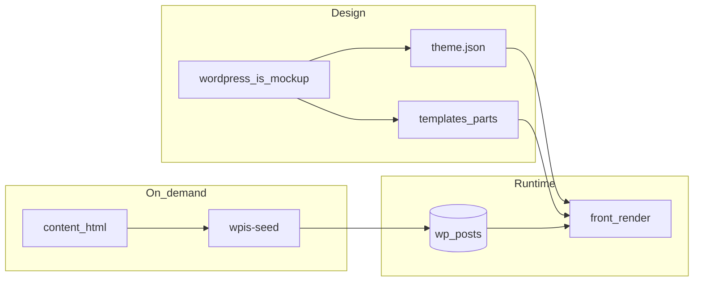

# Audit WPIS — thème bloc FSE vs Twenty Twenty * vs maquette

**Périmètre:** [wpis-theme/](../) (dépôt) — **ce fichier** : `docs/wpis-fse-theme-audit.md`  
**Sources de vérité (dépôt monorepo / clone à côté du thème) :** [wordpress-is-mockup.html](../../wordpress-is-mockup.html) (11 écrans), [wordpress-is-vision.md](../../wordpress-is-vision.md), [wordpress-is-cursor-plan.md](../../wordpress-is-cursor-plan.md)  
**Référence « canon » thème bloc :** [WordPress/twentytwentyfive](https://github.com/WordPress/twentytwentyfive) — `theme.json`, `styles/`, `templates/`, `parts/`, `patterns/` (pas d’écriture base au chargement thème)

---

## 1. Résumé exécutif

- Le thème repose sur une **séparation claire** : jetons et variations dans `theme.json`, compléments CSS et mode sombre dans [assets/css/wpis-global.css](../assets/css/wpis-global.css), corps d’écran dans [content/html/*.html](../content/html/) avec patterns enregistrés par [inc/register-patterns.php](../inc/register-patterns.php) et import démo **optionnel** via `wp wpis-seed` ([inc/wpis-cli-seed.php](../inc/wpis-cli-seed.php)) ou **Apparence → Importer la démo** ([inc/admin-seed.php](../inc/admin-seed.php)). **Aucun** hook `after_switch_theme` n’apparaît dans le thème, en phase avec l’esprit Twenty Twenty.
- **Documentation d’intention** : [docs/wpis-fse-architecture.md](../../docs/wpis-fse-architecture.md) et [.cursor/rules/wpis-fse-theme.mdc](../../.cursor/rules/wpis-fse-theme.mdc) sont **alignés** sur le code (import explicite, `wpis-global.css`, pas de seed à l’activation), avec le [README.md](../README.md) (étape d’installation sur la démo).
- **Gaps produit (suivi 2026)** : [single-quote.html](../templates/single-quote.html), [archive-quote.html](../templates/archive-quote.html) et [taxonomy-claim_type.html](../templates/taxonomy-claim_type.html) couvrent le CPT / taxo ; [index.html](../templates/index.html) interroge `quote` (voir [THEME-INDEX-STRATEGY.md](THEME-INDEX-STRATEGY.md)) ; l’[home](../content/html/home.html) et le fichier motif [security.html](../content/html/security.html) (pattern « archive taxo », pas une page démo importée) utilisent un Query Loop sur `quote`. Le script `feed-demo.js` a été **retiré**.

### Chantier 1 (filtre `the_content` et presets) : critères de sortie

Le filtre [wpis_theme_semantic_colors_in_content](../functions.php) reste le mécanisme par défaut : le HTML enregistré peut encore référencer `var(--wp--preset--color--*)` (palette jour) et le thème re-map vers les alias sémantiques de [wpis-global.css](../assets/css/wpis-global.css) pour le contraste en mode nuit. **Stratégie retenue** : ne pas imposer une re-synchronisation de tout le contenu par défaut ; conserver le filtre tant que le volume de pages avec presets n’est pas migré bloc par bloc. Procédure de scan, décision et tests : [docs/wpis-fse-semantic-colors.md](wpis-fse-semantic-colors.md).

---

## 2. Inventaire (chemins clés, rôle, FSE, maquette)

Légende : **FSE** = `theme.json`, blocs, HTML de templates. **Démo** = contenu d’exemple / styles proches de la [maquette](../../wordpress-is-mockup.html).

| Zone               | Chemins                                                                                                                                         | Rôle                                                                                                                                                                 | FSE / démo                                        | Note                                                                                                    |
| ------------------ | ----------------------------------------------------------------------------------------------------------------------------------------------- | -------------------------------------------------------------------------------------------------------------------------------------------------------------------- | ------------------------------------------------- | ------------------------------------------------------------------------------------------------------- |
| Métadonnées        | [style.css](../style.css), [readme.txt](../readme.txt), [README.md](../README.md)                                                               | en-têtes, doc install                                                                                                                                                | Meta                                              | `README` = vérité import                                                                                |
| Thème FSE          | [theme.json](../theme.json)                                                                                                                     | jetons, `styles` globaux, variations `core/group` + `core/paragraph`                                                                                                 | FSE                                               | cœur visuel + complément [wpis-global.css](../assets/css/wpis-global.css)                               |
| Bootstrap          | [functions.php](../functions.php)                                                                                                               | `wpis_theme_get_content_html`, skip link, `the_content` → alias, supports, enreg. styles / variations, assets, [register-patterns.php](../inc/register-patterns.php) | FSE + `the_content`                               | filtre couleur = stratégie documentée (Chantier 1 ci-dessus)                                            |
| Setup / seed       | [inc/theme-setup.php](../inc/theme-setup.php), [inc/wpis-cli-seed.php](../inc/wpis-cli-seed.php), [inc/admin-seed.php](../inc/admin-seed.php) | manifest pages, menu **WPIS Primary**, lecture statique, `wp wpis-seed` ou écran admin                                                                               | Démo (DB)                                         | **Pas** d’accroche activation                                                                           |
| Patterns           | [inc/register-patterns.php](../inc/register-patterns.php)                                                                                       | enreg. patterns écran → `content/html/*.html`                                                                                                                        | FSE                                               | remplace d’anciens `*-body.php` monolithiques                                                           |
| Fragments inserter | [patterns/hero-stats-row.php](../patterns/hero-stats-row.php), [patterns/quote-card-negative.php](../patterns/quote-card-negative.php)          | blocs d’exemple                                                                                                                                                      | FSE + démo                                        | —                                                                                                       |
| CSS                | [assets/css/wpis-global.css](../assets/css/wpis-global.css)                                                                                     | `--`* sémantiques, `data-theme`, header/footer, feed, explore, cartes, **legacy** `.nav-bar` / `.screen` (~L87–L97)                                                  | maquette + FSE                                    | réduire quand le JSON couvre assez                                                                      |
| JS                 | [assets/js/theme-toggle.js](../assets/js/theme-toggle.js)                                                                                       | thème clair/sombre                                                                                                                                                   | toggle = garder                                   | `feed-demo.js` supprimé ; flux = Query Loop                                                                 |
| Polices            | [assets/fonts/](../assets/fonts/), [assets/fonts/README.txt](../assets/fonts/README.txt)                                                        | WOFF2 locaux                                                                                                                                                         | FSE (`fontFace` dans [theme.json](../theme.json)) | —                                                                                                       |
| Parts              | [parts/header.html](../parts/header.html), [footer.html](../parts/footer.html), [quote-feed-card.html](../parts/quote-feed-card.html)           | en-tête (nav `primary`), pied, fragment carte                                                                                                                        | FSE                                               | —                                                                                                       |
| Templates          | [templates/](../templates/) (`front-page`, `index`, `page`, `single`, `search`, `404` + `single-quote`, `archive-quote`, `taxonomy-claim_type`) | coquille + CPT / taxo                                                                                                                                                | FSE                                               | voir [THEME-INDEX-STRATEGY.md](THEME-INDEX-STRATEGY.md)                                                 |
| Contenu            | [content/html/*.html](../content/html/) (~11 fichiers)                                                                                          | **source unique** patterns + manifest pages `wpis-seed`                                                                                                              | démo                                              | `security`, `sample`, `search-demo`, `empty` : patterns et/ou 404 ; **hors** pages importées ([theme-setup.php](../inc/theme-setup.php)) |

**Règles Cursor** (mono-repo) : [no-oxford-comma-english.mdc](../../.cursor/rules/no-oxford-comma-english.mdc), [no-unauthorized-version-bumps.mdc](../../.cursor/rules/no-unauthorized-version-bumps.mdc) — OK ; [wpis-fse-theme.mdc](../../.cursor/rules/wpis-fse-theme.mdc) — **à jour** (import explicite, `wpis-global.css`).

---

## 3. Cohérence activation, seed, CLI

| Source                                                               | Comportement annoncé                                  | Statut                             |
| -------------------------------------------------------------------- | ----------------------------------------------------- | ---------------------------------- |
| [functions.php](../functions.php)                                    | pas de `after_switch_theme`                           | **Aligné TT***                     |
| [inc/theme-setup.php L1–3](../inc/theme-setup.php)                   | seed WP-CLI ou écran admin seulement                  | **Cohérent**                       |
| [README](../README.md)                                               | `wp wpis-seed` + Apparence → Importer la démo         | **Cohérent**                       |
| [docs/wpis-fse-architecture.md](../../docs/wpis-fse-architecture.md) | import explicite, pas d’activation, `wpis-global.css` | **Aligné** (réécriture post-audit) |
| [wpis-fse-theme.mdc](../../.cursor/rules/wpis-fse-theme.mdc)         | idem + commandes                                      | **Aligné**                         |

[wp wpis-seed import](../inc/wpis-cli-seed.php) : `sync_content` **vrai** par défaut (écrasement des corps de pages démo). Le [README](../README.md) et l’[architecture](../../docs/wpis-fse-architecture.md) le documentent ; `--no-sync` évite l’écrasement.

---

## 4. Tableau : écran maquette → WordPress

Barre d’outils [wordpress-is-mockup.html L495–L506](../../wordpress-is-mockup.html) : `home`, `detail`, `explore`, `taxonomy`, `search`, `about`, `how`, `submit`, `confirm`, `empty`, `profile`.

| Mockup      | Mécanisme WP                                                          | Pattern [register-patterns.php](../inc/register-patterns.php) / seed | Après `wpis-seed import`                  | Écarts                                                                                                                         |
| ----------- | --------------------------------------------------------------------- | -------------------------------------------------------------------- | ----------------------------------------- | ------------------------------------------------------------------------------------------------------------------------------ |
| home        | [front-page.html](../templates/front-page.html) + page `home`         | `home-body` → `home.html`                                            | contenu en **DB**                         | Query Loop (pattern) sur `quote` ; re-seed si besoin                                                                           |
| detail      | [single-quote.html](../templates/single-quote.html) (CPT)             | `detail-body` → `sample.html` (motif seulement)                      | **pattern**                               | pas de page `sample` en démo ; contenu réel = CPT                                                                               |
| explore     | page `explore`                                                        | `explore-body`                                                       | **DB**                                    | liens `claim` `/claim/…` + barres *sentiment* en blocs `columns` (plugin pour termes réels)                                    |
| taxonomy    | [taxonomy-claim_type.html](../templates/taxonomy-claim_type.html)     | `taxonomy-body` → **security.html** (motif seulement)               | **pattern**                               | pas de pages `taxonomy` / `security` en démo ; URLs publiques = taxo plugin                                                     |
| search      | [search.html](../templates/search.html) (+ Relevanssi optionnel)      | `search-body` → `search-demo.html` (motif seulement)                 | **pattern**                               | pas de page `search-demo` en démo                                                                                               |
| about       | page `about`                                                          | `about-body`                                                         | **DB**                                    | —                                                                                                                              |
| how         | page `how-it-works`                                                   | `how-body`                                                           | **DB**                                    | —                                                                                                                              |
| submit      | page `submit`                                                         | `submit-body`                                                        | **DB**                                    | forme → plugin REST                                                                                                            |
| confirm     | page `submitted`                                                      | `confirm-body`                                                       | **DB**                                    | —                                                                                                                              |
| empty / 404 | [404.html](../templates/404.html) + `empty.html` en pattern seulement | `empty-body`                                                         | **fichier** (pattern) ; pas d’import page | normal                                                                                                                         |
| profile     | page `profile`                                                        | `profile-body`                                                       | **DB**                                    | données profil = plugin                                                                                                        |

---

## 5. Comparaison Twenty Twenty-Four / Five

[twentytwentyfive](https://github.com/WordPress/twentytwentyfive) structure `theme.json`, `templates/`, `parts/`, `patterns/`, **sans** création de contenus au chargement. **wpis-theme** suit ce principe côté **code** (seed via outil). Deux **écarts** de « pureté » : le filtre [the_content](../functions.php) sur variables CSS, et l’enregistrement de styles côté PHP en parallèle de [theme.json](../theme.json) (habituel).

---

## 6. `theme.json` vs `wpis-global.css` vs JS

- **theme.json** : [layout 720 / 1320px](../theme.json) ; paires de couleurs jour/nuit ; variations `wpis-`* (groupes) ; alignement global des hex avec la [maquette L9–L24](../../wordpress-is-mockup.html).
- **wpis-global.css** : L23+ aliases **obligatoires** pour le couple `data-theme` + [theme-toggle.js](../assets/js/theme-toggle.js) ; skip-link ; header/footer ; explore (`.tax-card`, etc.) et feed (`.quote-card`). `.nav-bar` / `.screen` = **héritage outil** maquette, supprimables si plus référencés.
- **Filtre** `wpis_theme_semantic_colors_in_content` [functions L50–66](../functions.php) : raccourci pour sombre (voir chapitre *Chantier 1* en tête de ce document et [wpis-fse-semantic-colors.md](wpis-fse-semantic-colors.md)) ; alternative long terme : n’enregistrer que des alias dans le contenu, ou étendre le remplacement aux champs d’**attributs** de blocs.
- **theme-toggle** : L26+ `data-theme` / stockage / icône ; [parts/header L13–L14](../parts/header.html) `aria-label` sur le lien.
- **Flux liste** : [Query Loop + plugin](../../docs/wpis-feed-query-loop.md) pour home, security et gabarits d’archive.

---

## 7. Listes priorisées

### À supprimer ou conditionner (démo)

- Règles `**.nav-bar` / `.screen`** inutilisées dans le contenu public.
- (Traité) **feed-demo.js** retiré.
- (Traité) Ancienne dette `after_switch_theme` / ancien fichier `wpis-chrome.css` (remplacé par `wpis-global.css`) : docs et règle Cursor alignées sur le code.

### À recoder (blocs / templates / architecture)

- (Traité) `core/html` retiré des seeds listés ; politique dans [wpis-fse-exceptions.md](wpis-fse-exceptions.md).
- (Traité) Filtre **the_content** (couleurs) : voir *Chantier 1* en tête de ce document.
- (Traité) [templates/index.html](../templates/index.html) : `postType: quote` ; [THEME-INDEX-STRATEGY.md](THEME-INDEX-STRATEGY.md).

### À garder provisoirement

- **wpis-global.css** dense tant que le HTML démo reste riche en classes.
- `register_block_style` + `theme.json` (double déclaration) pour l’inserter.
- Emplacement `primary` + [parts/header.html](../parts/header.html) (menu classique, rempli par `wpis-seed` si import).
- **Skip link** [functions L30+](../functions.php) (évite l’invalideur éditeur).
- Manifest démo = pages « flux » uniquement ; taxo / fiche citation / recherche = gabarits + plugin.

---

## 8. Architecture cible

- **Aucun** write DB sur **switch** de thème.
- **Outils** : `wp wpis-seed` / **Apparence → Importer la démo**.
- **Vérité** : [theme.json](../theme.json) + [templates/](../templates/) + [parts/](../parts/) ; éditorial en **DB** après import voulu.
- **Plugin** : CPT, taxos, soumission, profil — [wordpress-is-vision.md](../../wordpress-is-vision.md), [docs/wpis-plugin-boundary-submit.md](../../docs/wpis-plugin-boundary-submit.md).

---

## 9. Qualité, limites

Pas de chaîne CI ni d’outil de scan markup dans **wpis-theme** à ce stade ; contrôle manuel dans l’éditeur et `php -l` si besoin. Le plugin **wpis-plugin** conserve son propre Composer / lint.

---

## 10. Index des références (fichiers `wpis-theme/`)

| Sujet              | Fichier                                                                                                                 |
| ------------------ | ----------------------------------------------------------------------------------------------------------------------- |
| Manifest           | `inc/theme-setup.php` `wpis_theme_setup_get_manifest`                                                                   |
| Patterns écran     | `inc/register-patterns.php`                                                                                             |
| Filtre contenu     | `functions.php` `wpis_theme_semantic_colors_in_content`                                                                 |
| Navigation         | `parts/header.html`                                                                                                     |
| Assets             | `functions.php` `wpis_theme_enqueue_assets` L204+                                                                       |
| CLI                | `inc/wpis-cli-seed.php`                                                                                                 |
| Assets JS          | `assets/js/theme-toggle.js` uniquement (`feed-demo.js` supprimé)                                                        |
| Sémantique couleur | `assets/css/wpis-global.css` L1–L77                                                                                     |

*Aucun bump de `Version` dans `style.css`.*